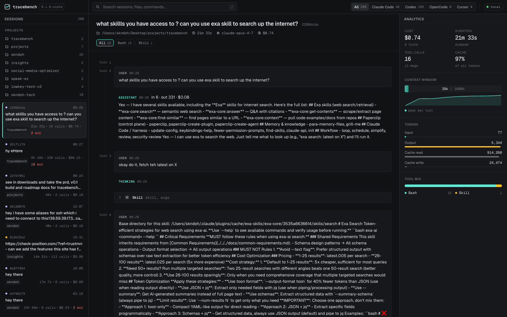

# tracebench

> Local-first viewer for AI coding agent sessions.

```bash
npx tracebench
```

[](https://www.npmjs.com/package/tracebench)
[](./LICENSE)

Tracebench reads session logs from supported agent harnesses — **Claude Code, OpenCode, Codex, and Cursor** — and renders them into one unified viewer. The wedge is harness-agnosticism: most people use more than one tool, and existing viewers each tie themselves to one harness.

This is local, no cloud, no telemetry. Apache 2.0.



## Status — v0.1.1

| | What |
|---|---|
| Adapters live | `claude_code`, `codex` |
| Adapters planned | `opencode`, `cursor` (UI tabs present but disabled) |
| UI | Vite + React 18 — three-pane layout, tool-aware timeline (Bash/Read/Edit/Write/Grep + Codex `exec_command` and `apply_patch` aliases), analytics rail, harness tabs |
| Backend | Fastify on `127.0.0.1`, SQLite via `better-sqlite3`, multi-adapter indexer |
| Tests | **75 passing** across 5 packages (core 26, adapter-claude-code 17, adapter-codex 19, server 13, ui typecheck-only) |
| Real-world | Indexes **44 Claude Code + 276 Codex** sessions on the maintainer's machine; cumulative cost surfaced ≈ $3k |
| Performance | 44-session Claude Code dir: ~370ms; full mixed index of 320 sessions stays well under acceptance |
| **Not done** | Plugin loader (adapters still in-tree, registered in `packages/server/src/adapters.ts`), public adapter authoring guide, Windows support, OpenCode/Cursor adapters |

## Install

```bash
npx tracebench
```

That's it. Opens at **http://127.0.0.1:3478**.

On first run it indexes everything under `~/.claude/projects` and `~/.codex/sessions`, then keeps an SQLite cache at `~/.tracebench/tracebench.db` so subsequent boots are near-instant.

### Flags

| Flag | Default | Notes |
|---|---|---|
| `--port <n>` | `3478` | listen port |
| `--host <h>` | `127.0.0.1` | listen host |
| `--dir <path>` (alias `--claude-dir`) | `~/.claude/projects` | Claude Code projects root |
| `--codex-dir <path>` | `~/.codex` | Codex sessions root |
| `--db-path <path>` | `~/.tracebench/tracebench.db` | SQLite location |
| `--no-open` | — | skip browser auto-launch |
| `--no-index` | — | skip the startup re-index pass |
| `-v` / `--verbose` | — | verbose stderr logging |

### From source (contributors only)

```bash
git clone https://github.com/Skandesh/tracebench
cd tracebench
pnpm install
pnpm -r build
node packages/server/dist/cli.js
```

## Architecture

Three layers with stable contracts in between.

```
packages/
├── core/                       schema, SQLite + migrations, pricing, query API
├── adapter-claude-code/        reads ~/.claude/projects/**/*.jsonl, normalizes
├── adapter-codex/              reads ~/.codex/sessions + archived_sessions, normalizes
├── server/                     Fastify routes + CLI entry + multi-adapter indexer
└── ui/                         Vite + React 18, ported from the prototype
```

The adapter registry lives at `packages/server/src/adapters.ts` — adding a new harness today means writing one adapter package and adding one entry there. Dynamic plugin loading is a v0.4 task.

### Canonical event schema

Adapters produce, and the UI consumes, a single shape (`packages/core/src/schema.ts`). The shape is versioned; it becomes stable at v1.0.

### Cost methodology

Cost is computed from a vendored LiteLLM-style pricing table (`packages/core/pricing.json`). The formula is in `pricing.ts`:

```
cost_usd = input * input_per_token
        + (output + reasoning) * output_per_token
        + cache_read * cache_read_per_token
        + cache_creation * cache_creation_per_token
```

`cost_method` is `"logged"` when the harness reports a cost directly, `"estimated"` when we compute from the table, `null` for unknown models. The UI surfaces this — no silent guessing.

### Indexer

On startup, the server walks `~/.claude/projects` and indexes any session whose mtime is newer than the one in SQLite. Re-index is cheap (~1ms per session in the skip path) so it runs every boot. Trigger a manual re-index with `POST /api/reindex`.

## API

| Endpoint | Description |
|---|---|
| `GET /api/health` | liveness |
| `GET /api/sessions?harness=&q=&limit=&offset=` | session list with aggregates |
| `GET /api/sessions/:id` | session + tool counts |
| `GET /api/sessions/:id/turns` | events grouped into turns |
| `GET /api/sessions/:id/events` | flat event list, seq order |
| `GET /api/pricing` | the vendored pricing table |
| `POST /api/reindex` | force a re-index pass |

## Repo layout

```
tracebench/
├── packages/
│   ├── core/                          @tracebench/core
│   ├── adapter-claude-code/           @tracebench/adapter-claude-code
│   ├── adapter-codex/                 @tracebench/adapter-codex
│   ├── server/                        @tracebench/server (publishes `tracebench` bin)
│   └── ui/                            @tracebench/ui
├── package.json
├── pnpm-workspace.yaml
├── tsconfig.base.json
└── LICENSE                            Apache 2.0
```

## Development

```bash
# install
pnpm install

# typecheck everything
pnpm -r typecheck

# test everything
pnpm -r test

# build everything
pnpm -r build

# UI dev server (proxies /api to localhost:3478, so run the server too)
pnpm --filter @tracebench/server start
pnpm --filter @tracebench/ui dev
```

## Changelog

See [CHANGELOG.md](./CHANGELOG.md).

## Roadmap

- **v0.1 (current)** — Claude Code + Codex adapters, multi-adapter indexer, cross-harness UI
- **v0.2** — Adapter authoring guide, Windows support, per-adapter fixture CI
- **v0.3** — OpenCode + Cursor adapters (all four harnesses live)
- **v0.4** — Context window analyzer, cost/time dashboards, behavior analytics
- **v0.5+** — Plugin loader, plugin registry, comparative views, live tail, HTML export, annotations, sub-agent viz
- **v1.0** — Schema stable, semver guarantees, all 4 supported adapters, 2nd maintainer

## License

Apache 2.0. The explicit patent grant matters in tooling where contributors may work at AI labs.
